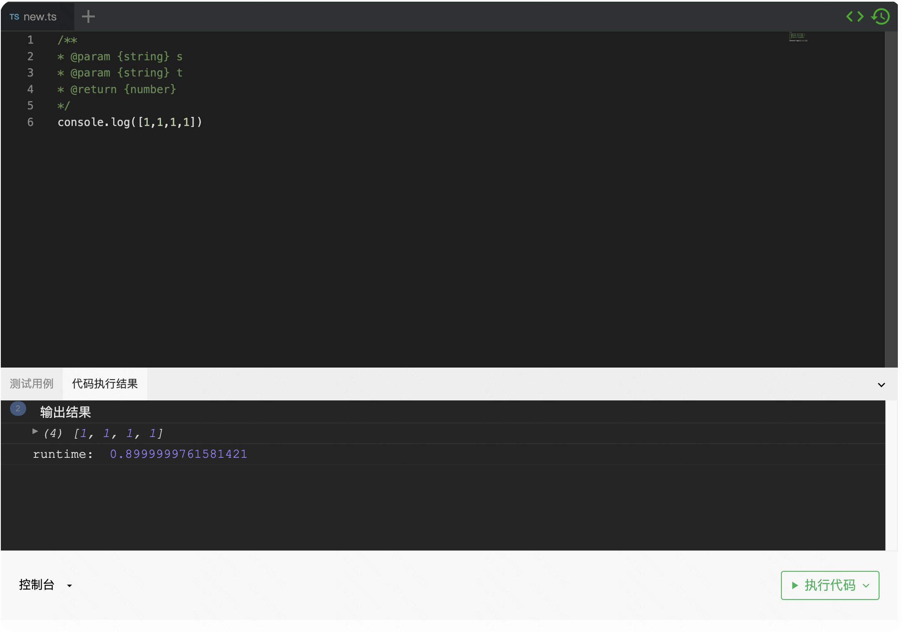
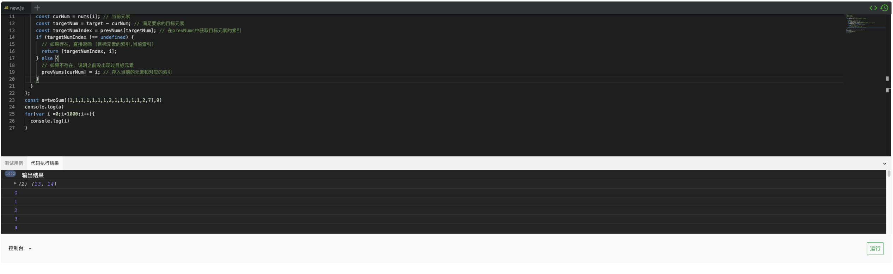

<div align="center">
  
  <h1>Cora编辑器</h1>
  <p>一个基于 monaco-editor 在线编辑器插件</p>
  <p>
    <a href="https://github.com/paiDaXing-web/Cora" target="_black">
      
    </a>
    <a href="https://github.com/paiDaXing-web/You-Don-t-Know-TS" target="_black">
      
    </a>
    <a href="https://github.com/paiDaXing-web/You-Dont-Know-Algorithm" target="_black">
      
    </a>
    <a href="https://youjia.sx.cn/algorithm/" target="_black">
      
    </a>
  </p>
</div>

<div align="center">

| 适配框架 | npm 包 | 最新版本 | npm 下载量 | CDN 使用量 |
| :------: | :----: | :------: | :--------: | :--------: |


| `React` | [@cora](https://github.com/paiDaXing-web/Cora) |  | <a href="https://github.com/paiDaXing-web/Cora" target="_black"></a> | <a href="https://github.com/paiDaXing-web/Cora" target="_black"></a> |

</div>

<br />


## 🙏🙏🙏 点个 Star

**如果您觉得这个项目还不错, 可以在 [Github](https://github.com/paiDaXing-web/Cora) 上面帮我点个`star`, 支持一下作者 ☜(ﾟヮﾟ ☜)**

<br />

<!-- lerna过滤器配置 -->
<!-- https://github.com/lerna/lerna/tree/main/core/filter-options#readme -->

## Usage

This component builds itself. You can render an empty editor like this:

```typescript
import React from 'react';
import Editor from 'react-run-code';

function App() {
  return <Editor id="10" modelsInfo={[]} />;
}

export default App;
```

Then you can make new tabs and start filling in your code. Clicking on the green `<>` button copies the generated `modelsInfo` prop to your clipboard.


You can now go into your source code and paste `[{"value":"console.log(\"make a new file\")","filename":"new.ts","language":"typescript"}]` in place of `[]` in the prop `modelsInfo={[]}`.

## Experimental

You can do import and export statements, but they just concatenate files on the basis of a topological sort. Open a file 0.ts if you want to see what is going on, that file is the one that gets transpiled to JavaScript and executed by your browser. The files are shared across the webpage. Here is an example of us importing "file1.ts" from "file2.ts" but getting an error because there is no real bundler.


## 使用方法

# Cora




